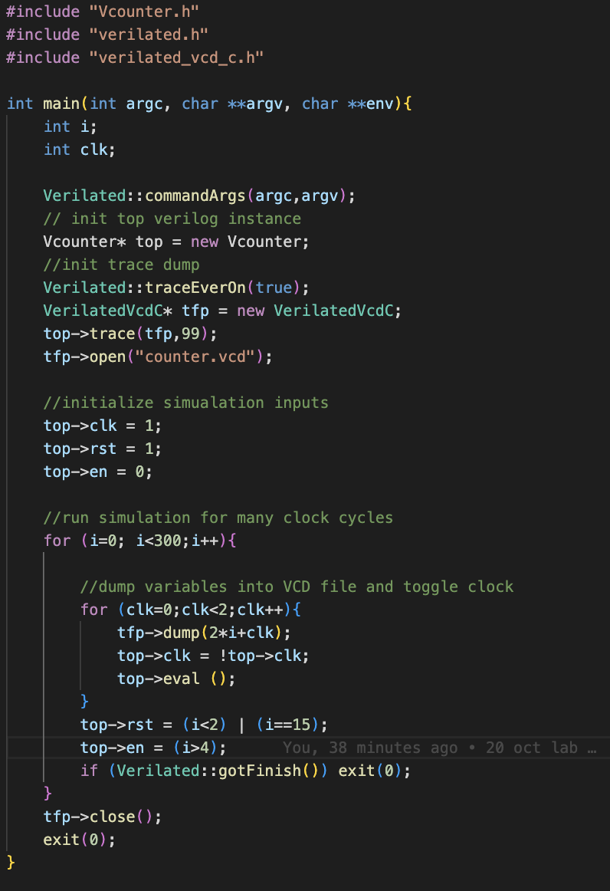

#### Department of Electrical & Electronic Engineering, Imperial College London

### EIE 2 Instruction Set Architecture & Compiler (IAC) 2022
---
### Shermaine Ang 

## Lab 1 – Learning System Verilog with Verilator and Vbuddy

#### 20 October 2022
### Task 1
---

#### Problems Encountered
When writing the code for the testbench, we had errors that the files needed to be included (at the beginning) were not found. This was because the folder that we are working on had to be the top directory. Hence, we fixed that by changing our directory and it went smoothly.

This is the code for the testbench used in task 1:

I noticed that there were fewer problems encountered on MacOS, and by following the steps, I managed to get the expected wave as seen below:

Waveform Description:
2nd rising edge --> i=0
rst = 1 when i < 2 (when 0,1,2)
en = 1 when i > 4 (i==5)
The timing was noticed to be in ps, but we were informed that these could be ignored, and did not mean anything.

