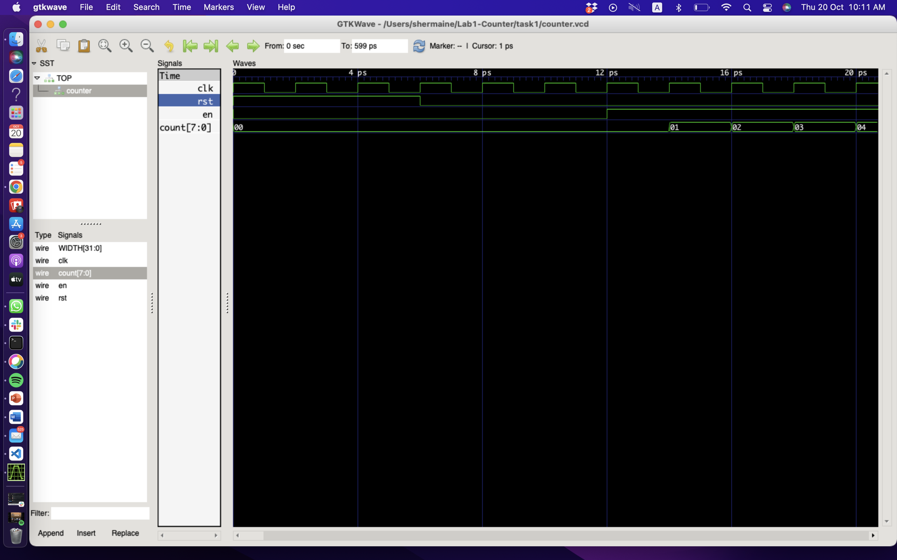

#### Department of Electrical & Electronic Engineering, Imperial College London


### EIE 2 Instruction Set Architecture & Compiler (IAC) 2022
---
### Shermaine Ang 


## Lab 1 – Learning System Verilog with Verilator and Vbuddy

#### 20 October 2022
### Task 1
---

#### Problems Encountered
When writing the code for the testbench, we had errors that the files needed to be included (at the beginning) were not found. This was because the folder that we are working on had to be the top directory. Hence, we fixed that by changing our directory and it went smoothly.

#### Creating System Verilog file
Create a new System Verilog file (counter.sv) The schematic representation of this basic counter is shown below. It counts on the positive edge of clk if enable is ‘1’.  It is synchronously reset to 0 if rst is asserted. 


Note the following:
1.	The file name and the module name must be the same.
2.	The number of bits in the counter is specified with the parameter WIDTH. It is currently set to 8-bit. 
3.	The always_ff @ (posedge clk) is the way that one specifies a clocked circuit. 
4.	‘<=’ in line 12 and 13 are non-block assignments which should be used within an always_ff block.
5.	{WIDTH{1’b0}} in line 12 uses the concatenation operator { } to form WIDTH bits of ‘0’. (Can you explain the construct in line 13?)

Here is the mapping between System Verilog and the counter circuit "synthesized" via Verilator:


#### Creating testbench file in C++
This has to be done before we can combine everything to make the executable model.  

This testbench file is a template for all other testbench files. It consists of various sections, which are mandatory (except for the trace dump section if you don’t want to see the waveforms).


#### Compiling the System Verilog model with testbench
The following command was used on Terminal:
```bash
# run Verilator to translate Verilog into C++, including C++ testbench
verilator -Wall --cc --trace counter.sv --exe counter_tb.cpp
```

This runs Verilator to translate counter.sv into C++ code, and merge with **_counter_tb.cpp_** to produces a number of files in a new folder: **obj_dir**. It also automatically generates a **_.mk_** file called **_Vcounter.mk_**, which will produce the final simulation model **_Vcounter_**.

Next, this was entered:

```bash
# build C++ project via make automatically generated by Verilator
make -j -C obj_dir/ -f Vcounter.mk Vcounter
```

This makes **_Vcounter_**, which is the executable model of our counter!  

We are now ready to simulate by simply running **_Vcounter_**, which is again in the **_obj_dir/._** directory, by entering:

```bash
# run executable simulation file
obj_dir/Vcounter
```
In the folder task1, a file **_Vcounter.vcd_** has been generated.  This is the trace waveform file and contains the simulation results.

#### Plotting waveforms with GTKwave
I noticed that there were fewer problems encountered on MacOS, and by following the steps, I managed to get the expected wave as seen below:



Make sure you understand all waveform signals.  

##### Why is the time axis in ps? Does it matter?
It does not matter

##### Waveform Description
2nd rising edge --> i=0

rst = 1 when i < 2 (when 0,1,2)

en = 1 when i > 4 (i==5)


