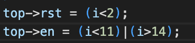
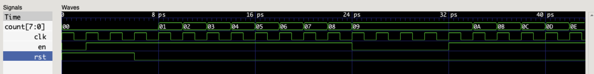
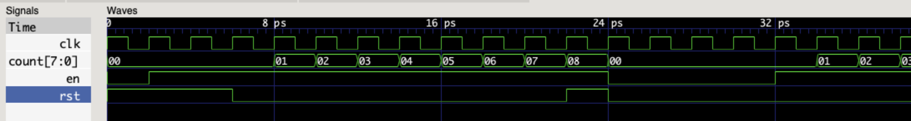
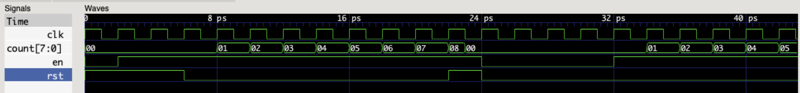
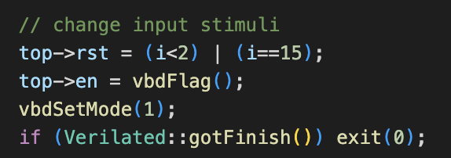

#### Department of Electrical & Electronic Engineering, Imperial College London


### EIE 2 Instruction Set Architecture & Compiler (IAC) 2022
---
### Shermaine Ang 


## Lab 1 – Learning System Verilog with Verilator and Vbuddy

#### 20 October 2022
### Task 1
---

### Problems Encountered
When writing the code for the testbench, we had errors that the files needed to be included (at the beginning) were not found. This was because the folder that we are working on had to be the top directory. Hence, we fixed that by changing our directory and it went smoothly.

#### Creating System Verilog file
Create a new System Verilog file (counter.sv) The schematic representation of this basic counter is shown below. It counts on the positive edge of clk if enable is ‘1’.  It is synchronously reset to 0 if rst is asserted. 


Note the following:
1.	The file name and the module name must be the same.
2.	The number of bits in the counter is specified with the parameter WIDTH. It is currently set to 8-bit. 
3.	The always_ff @ (posedge clk) is the way that one specifies a clocked circuit. 
4.	‘<=’ in line 12 and 13 are non-block assignments which should be used within an always_ff block.
5.	{WIDTH{1’b0}} in line 12 uses the concatenation operator { } to form WIDTH bits of ‘0’. (Can you explain the construct in line 13?)

Here is the mapping between System Verilog and the counter circuit "synthesized" via Verilator:


#### Creating testbench file in C++
This has to be done before we can combine everything to make the executable model.  

This testbench file is a template for all other testbench files. It consists of various sections, which are mandatory (except for the trace dump section if you don’t want to see the waveforms).


#### Compiling the System Verilog model with testbench
The following command was used on Terminal:
```bash
# run Verilator to translate Verilog into C++, including C++ testbench
verilator -Wall --cc --trace counter.sv --exe counter_tb.cpp
```

This runs Verilator to translate counter.sv into C++ code, and merge with **_counter_tb.cpp_** to produces a number of files in a new folder: **obj_dir**. It also automatically generates a **_.mk_** file called **_Vcounter.mk_**, which will produce the final simulation model **_Vcounter_**.

Next, this was entered:

```bash
# build C++ project via make automatically generated by Verilator
make -j -C obj_dir/ -f Vcounter.mk Vcounter
```

This makes **_Vcounter_**, which is the executable model of our counter!  

We are now ready to simulate by simply running **_Vcounter_**, which is again in the **_obj_dir/._** directory, by entering:

```bash
# run executable simulation file
obj_dir/Vcounter
```
In the folder task1, a file **_Vcounter.vcd_** has been generated.  This is the trace waveform file and contains the simulation results.

#### Plotting waveforms with GTKwave
I noticed that there were fewer problems encountered on MacOS, and by following the steps, I managed to get the expected wave as seen below:


#### Why is the time axis in ps? Does it matter?
It does not matter

#### Waveform Description
2nd rising edge --> i=0

rst = 1 when i < 2 (when 0,1,2)

en = 1 when i > 4 (i==5)

#### Creation of shell script
This is a shortcut to avoid retyping all the commands to make the executable model.
Created a shell script doit.sh with the following


We can now run all the commands in one go by typing:   
```bash
source ./doit.sh
```
## TEST YOURSELF CHALLENGE
1.	Modify the testbench so that you stop counting for 3 cycles once the counter reaches 0x9, and then resume counting.  You may also need to change the stimulus for _rst_.

The following changes were made:



New GTKwave:



2.	The current counter has a synchronous reset. To implement asynchronous reset, you can change line 11 of counter.sv to detect change in _rst_ signal.  (See notes.) 

Asynchronous reset: Circuit should reset whenever reset signal is active 'Irrespective' of clock.

Changes made:


This causes the counter to not increase in the same clock cycle as the reset. Reset applies at the current rising edge of the clock. Comparatively for a synchoronous reset the reset only applies on the next rising edge of the clock.

#### Synchronous Reset



#### Asynchronous Reset



## Task 2
????


## Task 3: Vbuddy parameter & flag in one-shot mode (OPTIONAL)

The rotary encodes (EC11) provides input from Vbuddy to the Verilator simulation model.  Turning the encoder changes a stored parameter value on Vbuddy independently from the Verilator simulation.  This parameter value can be read using the **_vbdValue( )_** function, and is displayed on the bottom left corner of the TFT screen in both decimal and hexadecimal format.  

**Step 1: Loadable counter**

Copy across to the task3 folder the required files: **_counter.sv, counter_tb.cpp, vbuddy.cpp, doit.sh_** and **_vbuddy.cfg_**.  

Vbuddy’s flag register has two modes of operation.  The default mode is **TOGGLE**, which means that everything the rotary encoder switch is pressed, the flag will toggle as indicated at the bottom of the TFT screen.  

However, using the **_vbdSetMode(1)_** function, you can set the mode to ONE-SHOT behaviour. Whenever the switch is pressed, the flag register is set to ‘1’ as before – now the flag is **“ARMED”** ready to fire. However, when the flag register is read, it immediate resets to ‘0’.  

Modify **counter.sv** so that pressing the switch on EC11 forces the counter to pre-set to Vbuddy’s parameter value. (How?)  Compile and test your design.

(i have no idea what this task is asking me to do)

**Step 2: Single stepping**

Using the one-shot behaviour of the Vbuddy flag, it is possible to provide one clock pulse each time you press the rotary encoder switch.  In other words, you can single step the counting action.  

Modify **counter.sv** so that you only increment the counter each time you press the switch.

### Modifications made
By adding a single line of code **_vbdSetMode(1)_**, the counter would increase everytime the switch is pressed.

